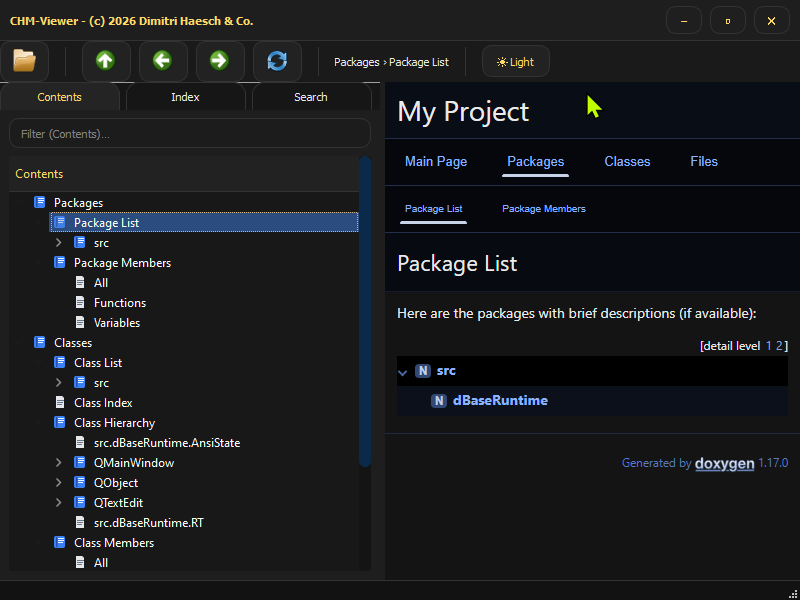

# PyCHMviewer
A Microsoft CHM compiled, and compressed Help File Viewer as an alternative for the
old out of date existing original CHM Viewer introduced with Windows 95.

It runs under 32, and 64-Bit Versions of the Microsoft Operating System 10/11

Alpha Prototype

